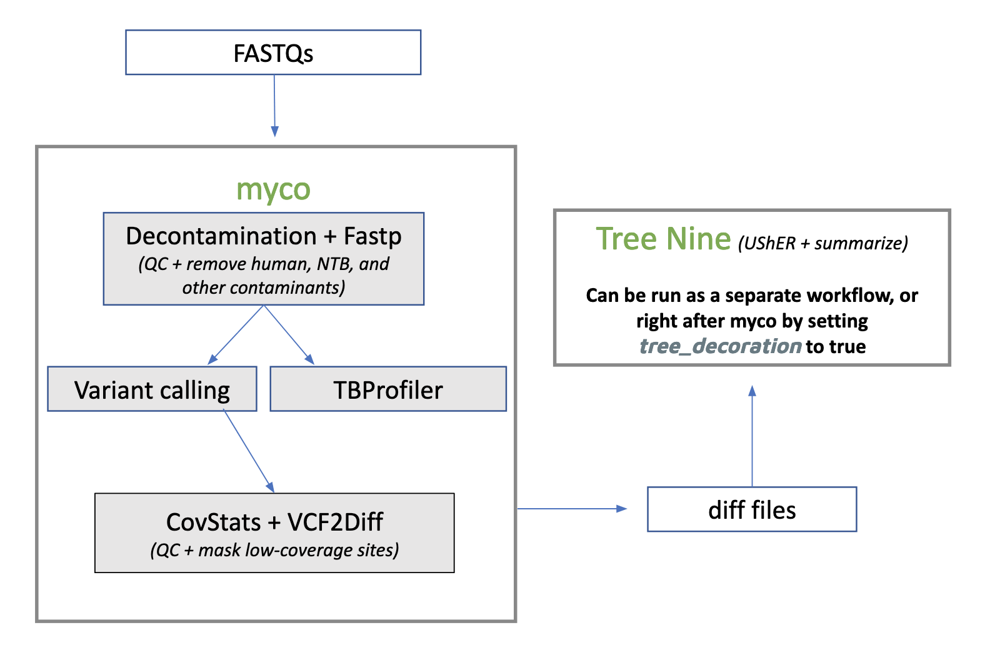

# myco_raw
myco_raw is the version of myco to use if you already have a bunch of fastqs, divided on a per-sample basis, and you want to decontaminate them before calling variants.

## Notable inputs
You need your FASTQs as a nested array, where each inner array represents one sample. For example, let's say you the following samples in a google bucket located at gs://my-cool-bucket/fqs/
* SAMN02599053, consisting of SAMN02599053_SRR1173122_1.fq.gz, SAMN02599053_SRR1173122_2.fq.gz, SAMN02599053_SRR1173191_1.fq.gz, and SAMN02599053_SRR1173191_2.fq.gz
* SAMN13813990, consisting of SAMN13813990_SRR10869128_1.fq.gz and SAMN13813990_SRR10869128_2.fq.gz

You would input the following for **paired_fastq_sets**:

```
[["gs://my-cool-bucket/fqs/SAMN02599053_SRR1173122_1.fq.gz", "gs://my-cool-bucket/fqs/SAMN02599053_SRR1173122_2.fq.gz", "gs://my-cool-bucket/fqs/SAMN02599053_SRR1173191_1.fq.gz", "gs://my-cool-bucket/fqs/SAMN02599053_SRR1173191_2.fq.gz"], ["gs://my-cool-bucket/fqs/SAMN13813990_SRR10869128_1.fq.gz", gs://my-cool-bucket/fqs/SAMN13813990_SRR10869128_2.fq.gz"]]
```

The first array represents sample SAMN02599053. The second array represents sample SAMN13813990. You will note that SAMN02599053 has two pairs of fastqs, while SAMN13813990 only has one pair of fastqs -- this is fine!

All other inputs are documented here: [inputs.md](./inputs.md)

## Full workflow process


### [0] clockwork Reference Prepare
Earlier versions of this workflow ran a subworkflow that followed [clockwork's reference preparation standards](https://github.com/iqbal-lab-org/clockwork/wiki/Walkthrough-scripts-only#get-and-index-reference-genomes). This step is no longer included because the reference genome is (relatively) standardized and can therefore be put directly into downstream Docker images. We note it here for users who may wish to generate their own decontamination reference. Those users can [see here for the archived subworkflow.](https://github.com/aofarrel/clockwork-wdl/blob/main/workflows/refprep-TB.wdl)

### [1] Clean and decontaminate
Based on [clockwork's decontamination process](https://github.com/iqbal-lab-org/clockwork/wiki/Walkthrough-scripts-only#decontaminate-the-reads), which runs clockwork map_reads and clockwork remove_contam in a single WDL task. The output is a group of decontaminated fastq files.

This step will also merge FASTQs if a single sample has more than one pair of FASTQs. For example, SAMN02599053 has four fastqs associated with it: 
* SAMN02599053_SRR1173122_1.fq.gz
* SAMN02599053_SRR1173122_2.fq.gz
* SAMN02599053_SRR1173191_1.fq.gz
* SAMN02599053_SRR1173191_2.fq.gz

The decontamination step will output a single pair: SAMN02599053_1.fastq and SAMN02599053_2.fastq

Additionally, this step will by default run fastp before decontamination takes place in order to clean the reads and perform some basic QC checks. You can flip to cleaning after decontamination by setting `clean_before_decontam` to false and `clean_after_decontam` to true. You can avoid fastp cleaning entirely by setting both of these to false, but post-decontamination QC -- as in, checking to make sure the entire sample is valid -- will run regardless.

### [2] Run TBProfiler
Runs [a sub-workflow wrapper](https://github.com/aofarrel/tb_profiler/blob/main/thiagen_tbprofiler.wdl) of [Thiagen's fork of TBProfiler](https://github.com/theiagen/public_health_bioinformatics). 

### [3] Call variants
Based on clockwork variant_call_single, which itself combines samtools, cortex, and minos. For each sample, the output is a single VCF file and a BAM file.

### [4] Run covstats
Run covstats (from the goleft software bundle) to determine mean coverage.

### [5] Mask the outputs and optionally create diff files
When feeding outputs into UShER, we want to make use of diff files. But first, we perform a little bit of data processing -- it common for some regions of the TB genome to be masked. We want to avoid those problematic regions in our final output, as well as any regions without much coverage. This task cleans up our outputs and optionally creates a diff file, one per sample, which can be used to make some happy little trees.

### [6] (optional) Generate UShER, Taxonium, and NextStrain trees
If decorate_trees = true, and an input tree is passed in, each sample will be placed on the tree by UShER. The resulting tree will then be converted to Taxonium format, allowing it to be viewed in taxonium. NextStrain subtree JSONs will also be generated.