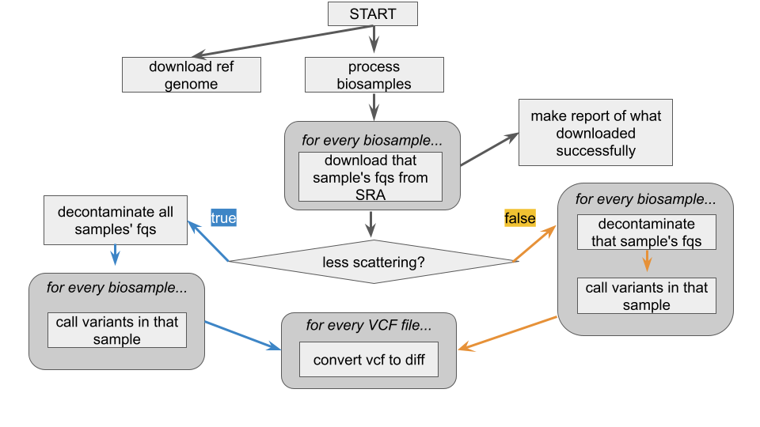

# myco: An overview

For information on running myco, [see here](./running_myco.md).




## [1a] clockwork Reference Prepare
Runs my implementation of [clockwork's reference preparation standards](https://github.com/iqbal-lab-org/clockwork/wiki/Walkthrough-scripts-only#get-and-index-reference-genomes):
1. Download TB reference files
2. Index the decontamination reference
3. Index the H37Rv reference

The outputs of this process are two tarballs, with the following structure:

```
 Ref.remove_contam.tar
  ├── ref.fa
  ├── ref.fa.fai
  ├── ref.fa.minimap2_idx
  └── remove_contam_metadata.tsv

 Ref.H37Rv.tar
  ├── ref.fa
  ├── ref.fa.fai
  ├── ref.fa.minimap2_idx
  └── ref.k31.ctx
```

This is a deterministic subworkflow, and Cromwell allows for cacheing of previous workflow outputs, so this process usually only runs once. If you are using a backend that doesn't support call cacheing, you can skip this process by inputting the following:
* ClockworkRefPrepTB.bluepeter__tar_tb_ref_raw
* ClockworkRefPrepTB.bluepeter__tar_indexd_dcontm_ref
* ClockworkRefPrepTB.bluepeter__tar_indexd_H37Rv_ref

## [1b] Extract BioSample accessions from input file
The user is expected to input a text containing BioSample accessions. This task grabs all unique lines in that file and outputs an Array[String] of BioSample accessions.

## [2] Pull fastqs for the BioSample accession *(myco_sra.only)*
This task pulls all fastqs for a given BioSample accession using [sra-tools](https://github.com/ncbi/sra-tools). One sample might have multiple accessions; all of them are pulled. Once pulled, my script attempts to remove everything that is not a set of paired fastqs. 

For example, let's say this task got SAMN08436121. This has only one run associated with it: SRR6650260. Pulling that yields three files: SRR6650260_1.fastq, SRR6650260_2.fastq, and SRR6650260.fastq. Only SRR6650260_1.fastq and SRR6650260_2.fastq will be returned.

## [3] Prepare a report of the results of the pull task *(myco_sra.only)*
There are some samples that return no valid fastqs. This task keep track of every sample's run accessions, and the result of trying to pull fastqs from each run accession.

## [4] Decontaminate
Based on [clockwork's decontamination process](https://github.com/iqbal-lab-org/clockwork/wiki/Walkthrough-scripts-only#decontaminate-the-reads), which runs clockwork map_reads and clockwork remove_contam. I have combined these two calls into one WDL task that can run on multiple samples at once. The output is a group of decontaminated fastq files.

This task can be run either one-sample-at-a-time or all at once, depending on the input less_scattering.

## [5] Call variants
Based on clockwork variant_call_single, which itself combines samtools, cotex, and minos. For each sample, the output is a single VCF file and a BAM file.

## [6] Mask the outputs and create diff files
When feeding outputs into UShER, we want to make use of diff files. But first, we perform a little bit of data processing -- it common for some regions of the TB genome to be masked. We want to avoid those problematic regions in our final output, as well as any regions without much coverage. This task cleans up our outputs and creates a diff file which can be used to make some happy little trees.
