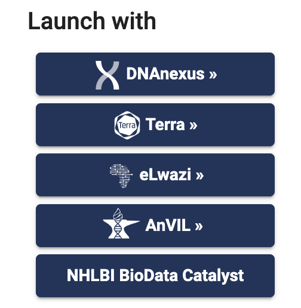

# Running myco

## Backends

### On Terra
These instructions assume you already have an account on [Terra](https://terra.bio/) and [a billing project set up](https://support.terra.bio/hc/en-us/articles/360026182251-How-to-set-up-billing-in-Terra).
1. [Go to myco's page on Dockstore](https://dockstore.org/workflows/github.com/aofarrel/myco/myco:main?tab=info)
2. On the right hand side of the Dockstore entry, select Terra under the heading "Launch with" 
3. Select which Terra workspace you wish to import into, or create a new one -- you'll then be taken to Terra
4. In Terra, go to the workflow tab (it's on the top below the bright green header bar), select myco, and run your workflow

Note: It is also possible to run myco by copy-pasting the WDL via the Broad Methods Repository, but doing this will not transfer over git versioning, nor will your copy of the workflow keep up-to-date automatically.

### On a local machine (ie: your laptop)
You will need:
* [miniwdl](https://github.com/chanzuckerberg/miniwdl) or [the Dockstore CLI](https://dockstore.org/quick-start) or [Cromwell](https://github.com/broadinstitute/cromwell)
* Python 3 if you're using miniwdl, or Java 11 (OpenJDK recommended) if using Dockstore CLI/Cromwell
* Docker Engine or Docker Desktop
  * if you are on a Linux machine, it is advised *not* to use Docker Desktop -- use Docker Engine instead

miniwdl generally works best for running myco locally, as it seems to handle local resources better than Cromwell (ie, doesn't crash the Docker daemon). Since this WDL uses mv commands on input files, you'll need to use the --copy-input-files option (and if you're debugging, you may want to throw in --verbose too).

`miniwdl run myco.wdl -i input/per_sample/quickmini.json --copy-input-files`

Cromwell is what Terra uses on the backend, so if you want are debugging locally in preparation for a big Terra run, I recommend using the Docktore CLI or latest version of Cromwell.

### On an HPC
Like most WDLs, myco uses a Docker image. However, many (not all) institutes do not allow Docker to run on their HPC systems for security reasons. Strictly speaking, [there are ways](https://docs.dockstore.org/en/stable/advanced-topics/docker-alternatives.html) to get around this limitation, but we cannot provide support for HPC users whose HPC administrators do not allow for running Docker images.

## Inputs
* samples: Text file listing BioSample accessions to pull reads from. Each line should have only one accession. SRS, SAM, ERS, and integer inputs are all supported. [Here's a bunch of sample files you can use!](https://github.com/aofarrel/SRANWRP/tree/main/inputs/quick_tests)
* min_coverage: Minimum coverage required to show up in the final diff file
* typical_tb_masked_regions: Currently we're using [this mask file](https://github.com/iqbal-lab-org/cryptic_tb_callable_mask/blob/43ec21319209b23f648f32e4868bdf07cf09f2a0/R00000039_repregions.bed) but you could insert your own.
